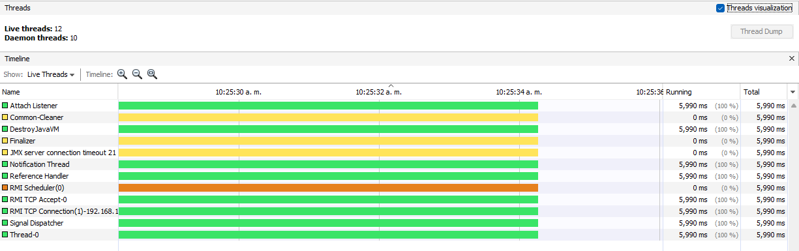

# Laboratorio 2

_Desarrollo y solución del laboratorio 2_

## Nombres:

* **Juan Carlos Alayon Molina**
* **Nicolas Medina Vargas**

### Parte I 
1. Revise el programa “primos concurrentes” (en la carpeta parte1), dispuesto en el paquete edu.eci.arsw.primefinder. Este es un programa que calcula los números primos entre dos intervalos, distribuyendo la búsqueda de los mismos entre hilos independientes. Por ahora, tiene un único hilo de ejecución que busca los primos entre 0 y 30.000.000. Ejecútelo, abra el administrador de procesos del sistema operativo, y verifique cuantos núcleos son usados por el mismo.

Al ejecutar el programa y mirar en el profiler la sección de Threads, se pudo ver que se estan utilizando 8, hay en espera 3 y 1 en estado park.

2. Modifique el programa para que, en lugar de resolver el problema con un solo hilo, lo haga con tres, donde cada uno de éstos hará la tarcera parte del problema original. Verifique nuevamente el funcionamiento, y nuevamente revise el uso de los núcleos del equipo.

Al realizarlo con tres hilos, se pudo ver se utilizaron 10, 3 en espera y uno en estado de park. Entre los utilizados 3 variaron entre el esado running y monitor.

3. Lo que se le ha pedido es: debe modificar la aplicación de manera que cuando hayan transcurrido 5 segundos desde que se inició la ejecución, se detengan todos los hilos y se muestre el número de primos encontrados hasta el momento. Luego, se debe esperar a que el usuario presione ENTER para reanudar la ejecución de los mismo.

Parte III

La region critica que se identifico fue la siguiente:

El problema que se presentaba es que habian mas de un ganador, al colocar el synchronized se logro que terminara solo un ganador del torneo como se muestra acontinuación:

Después de esto, se implemento las funciones de los botones Stop y Continue y se logro el siguiente resultado:

* Al oprimir el boton Stop

* Al oprimir el boton Continue 

Esto se realizo al colocar dentro del while de la funcion corre de galgo el synchronized y creando una funcion public synchronized la cual etenia o hacia que continuara la carrera.
